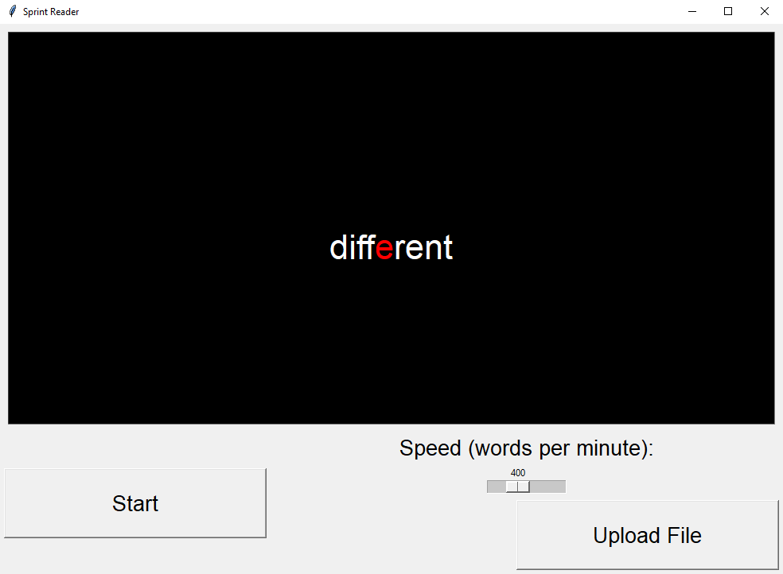

# Sprintre

Designed to enhance reading efficiency and comprehension by displaying text one word at a time at a user-defined pace. This tool aids in improving reading speed and focus, making it particularly useful for those seeking to boost their reading skills. By eliminating the need for traditional eye movements, this tool allows readers to process content more rapidly and is a valuable aid for anyone looking to become a more efficient and effective reader.

Coloring the a letter of the displayed word in red is a way to guide the eye during *Rapid Serial Visual Presentation* (RSVP). In this case, identifying the middle letter of the word and using it as *Optimal Recognition Point* (ORP) is a simple but effective method of RSVP.

## Install
```python
pip install PyPDF2 --upgrade
```


```python
pip install python-docx --upgrade
```


## Import Libraries

```python
import tkinter as tk
from tkinter import filedialog
from PyPDF2 import PdfReader
from docx import Document
import os
```

## Added Features
-) Font Selection

-) Pause and Resume

-) Custom Highlight Color: Red or Blue

# Sprintre In Action


